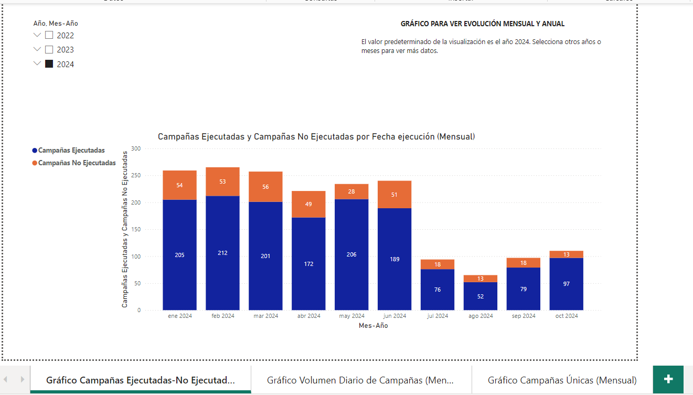
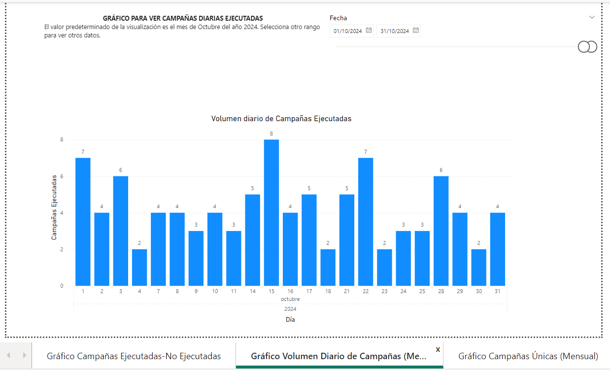
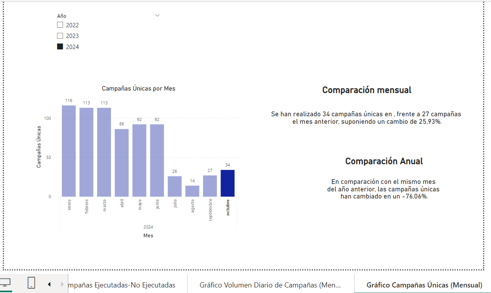

# PRODUCTION PROJECT: Automation of Monthly Reports with Power BI

## Project Overview
This project focuses on automating the generation of monthly reports using Power BI. The key components include:

- **Data Cleaning**: Ensuring the dataset is ready for analysis.
- **Model View Architecture**: Designing an efficient data model.
- **Dashboards with 3 Key Visualizations**:
  - **Chart 1**: Campaigns - Executed vs. Not Executed.
  - **Chart 2**: Daily Volume of Executed Campaigns, grouped by month.
  - **Chart 3**: Unique Campaigns Count, grouped by month, with automated text providing comparisons (monthly and yearly).

**Note:** The source Excel file belongs to NTT DATA and cannot be shared due to privacy policies. This report describes the steps taken to automate the process. The code is written originally in spanish. 

---

## Step-by-Step Process

### 1. Data Cleaning
Key actions performed on the dataset:
- Replaced string `nulls` in one column with actual `null` values.
- Changed the data type of a column from `Any` to `Text` as a best practice.
- Converted `null` values to `N/A` to ensure valid concatenation when creating a new column.
- Created a concatenated column.
- Cleaned a specific column to include only three options: `Yes`, `No`, and `Blank`. Used conditional logic and functions such as `.Trim` and `.Upper` to achieve this.
- Removed irrelevant null values from one of the target columns to simplify downstream analysis.

---

### 2. Model View Architecture
Before creating the KPIs and calculated columns in the main table:
- **Calendar Table**: Added a new table named `Calendar` to support time-based analysis. Established a `* : 1` (many-to-one) relationship between `Executions` and `Calendar` tables.  

(See attached images: `Many_to_one_relation.png` and `table_calendar.png`)

#### New Columns in Main Table:
- **Executed Campaigns**
- **Non-Executed Campaigns**
- **Unique Campaigns**

**Key DAX Code:**
```DAX
-- Unique Campaigns
Campañas Únicas = DISTINCTCOUNT(Ejecuciones[CampañaYCanal])

-- Executed Campaigns
Campañas Ejecutadas = CALCULATE(

    COUNTROWS(Ejecuciones),

    Ejecuciones[Ejecutada] = "Si"

)

-- Non-Executed Campaigns
Campañas No Ejecutadas = CALCULATE(

    COUNTROWS(Ejecuciones),

    Ejecuciones[Ejecutada] = "No"

)
```

#### Additional KPIs and Measures:
- **Campaigns per Day Ratio**: 
```DAX
Ratio Campañas por Día = [Campañas Ejecutadas] / COUNTX(FILTER(Calendario, Calendario[Es laborable] = TRUE()), Calendario[Fecha])
```

- **Automated Text Measure**: Provides monthly and yearly comparisons for total unique campaigns.
```DAX
-- Text Annual Comparison
Texto Comparación Anual =

"En comparación con el mismo mes del año anterior, las campañas únicas han cambiado en un " & FORMAT([Cambio Porcentual Año Anterior], "0.00") & "%."

-- Text Monthly Comparison
Texto Comparación Mensual =

"Se han realizado " & FORMAT([Campañas Únicas Mes Actual], "#,##0") & " campañas únicas en " &

FORMAT(SELECTEDVALUE(Calendario[Fecha]), "MMMM yyyy")&

", frente a" & FORMAT([Campañas Únicas Mes Anterior], "#, ##0") &

" campañas el mes anterior, suponiendo un cambio de " & FORMAT([Cambio Porcentual Mes Anterior], "0.00") & "%."
```

---

### 3. Dashboards & Visualizations
The following charts were created to highlight key insights:

1. **Campaigns: Executed vs. Not Executed**
   
   - This chart compares the number of executed campaigns to non-executed ones, providing a clear picture of campaign execution rates.

2. **Daily Campaign Volume (Monthly Grouped)**
   
   - Displays the volume of campaigns executed daily, grouped by month. This helps in identifying trends or peak periods.

3. **Unique Campaigns (Monthly Grouped)** 
   
   - Shows the count of unique campaigns grouped by month, with automated text providing comparisons for the previous month and the same month in the previous year.

---

## Project Impact
This solution significantly reduces the time spent generating monthly reports, which previously required a week of manual effort. Since the source Excel file is stored on SharePoint and updates automatically each month, Power BI dynamically reflects the latest data. This ensures the dashboards are always relevant and up-to-date, providing actionable insights efficiently.
