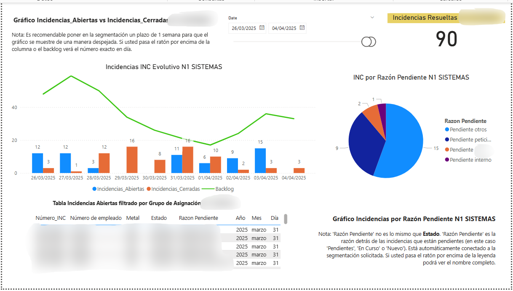
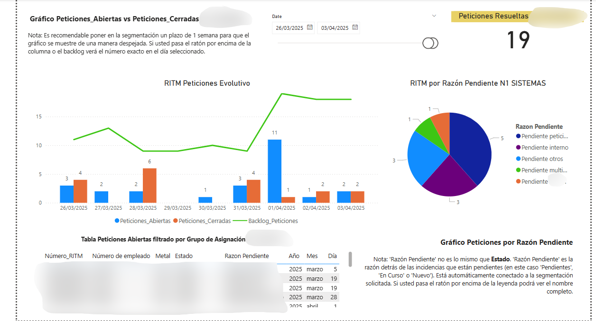
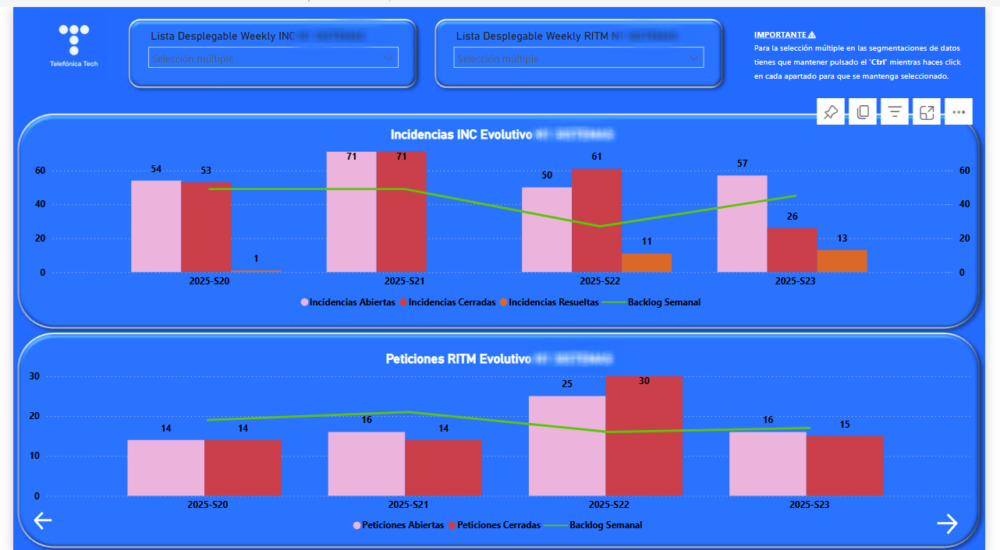
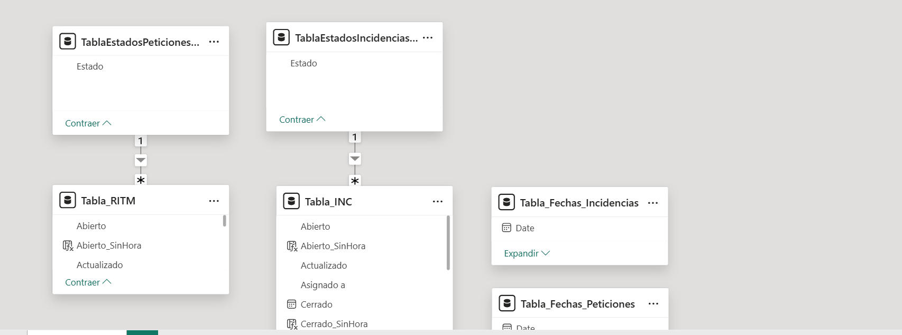

# Jira Dashboard for Telefónica – Incident & Request Monitoring  
This Power BI dashboard was built for **Telefónica** to monitor and analyze **Incidents (INC)** and **Requests (RITM)** retrieved from **Jira**. The report offers interactive visuals to track daily evolution, resolution status, and backlog across both areas — with **Incidents** as the primary focus.  
> ⚠️ Some details in the screenshots have been blurred due to the private nature of the data.  

---

## 🔍 Features  

### 🚨 Main Dashboard – Incidents (INC)  
- Track **open vs. closed incidents** daily.  
- Monitor the **backlog trend** over time.  
- Analyze **pending reasons** through a dynamic pie chart.  
- Filter data with interactive date slicers.  
- Explore raw incident data in a detailed table grouped by assignment.  

### 📥 Secondary Dashboard – Requests (RITM)  
- Similar layout applied to requests.  
- Breakdown of open vs. closed requests.  
- Insights into **why requests remain pending**.  
- Interactive breakdown by time and assignment group.  

### 📅 Weekly Aggregation  
- In addition to daily visuals, a **weekly trend chart** was added directly within the same Power BI file to better understand long-term patterns.  
- This view helps identify broader trends and smooth out daily fluctuations, complementing the day-by-day perspective.

---

## 🧠 Data Modeling  
A clean star schema was used to organize the data:  
- **Fact Tables**:  
  - `Tabla_INC` (Incidents)  
  - `Tabla_RITM` (Requests)  
- **Dimension Tables**:  
  - `TablaEstadosIncidencias`, `TablaEstadosPeticiones`  
  - `Tabla_Fechas_Incidencias`, `Tabla_Fechas_Peticiones`  
  Most tables are connected through 1-to-many relationships, which allows for efficient filtering across dates, states, and other dimensions.  

---

## 🌐 Data Source: SharePoint Integration  
Instead of using static Excel files via **File.Contents()**, this report uses **SharePoint as a dynamic source**. This was done using:  
```powerquery
Web.Contents("https://company.sharepoint.com/sites/YourSiteName/Shared Documents/YourFile.xlsx")
````

This allows the report to pull the latest data directly from SharePoint every time it's refreshed, ensuring it stays up to date without manual intervention.

> This approach is especially useful in collaborative environments where files are shared and updated frequently.

---

## 🔒 Date Type Handling for Power BI Service

To ensure the report worked seamlessly in the Power BI Service, I applied **date type handling (type casting)** within **Power Query**.

```powerquery
Table.TransformColumnTypes(YourTable, {{"DateColumn", type date}})
```

This step prevents date-related errors during refresh and allows proper filtering in reports published to the Service.

---

## ✨ Conditional Formatting

One important technique applied in this report was **conditional formatting for maximum values**, helping highlight key metrics — for example, the day with the most open incidents or requests — to better support decision-making at a glance.

---

## ⚠️ Visualization Tip: Avoid Mixed Metric Scales

An insight gained during the creation of this report:

> It is **not good practice** to place cumulative metrics (like backlog) in the same chart as daily counts (like opened/closed).
> In both the Incidents and Requests dashboards, charts that include **Backlog** along with **daily open/closed values** lose clarity — the cumulative line can overshadow the daily bars, making it harder to interpret the latter.
> 👉 Best practice: separate visuals for different metric scales.

---

## 🧰 Tools Used

* **Power BI Desktop**
* **DAX** for calculated columns and measures
* **Power Query (M)** for data transformation and SharePoint integration
* **Jira** as the data source (exported to Excel)
* **SharePoint** for centralized and refreshable storage

---

## 📸 Screenshots

| Incidents Dashboard                         | Requests Dashboard                        | Weekly Aggregation                   | Data Model                     |
| ------------------------------------------- | ----------------------------------------- | ------------------------------------ | ------------------------------ |
|  |  |  |  |

---

## 🔐 Disclaimer

Some data has been blurred or anonymized due to confidentiality agreements. This project is shown for demonstration purposes only and is not intended for production use outside the original scope.

---

## 📬 Contact

Feel free to reach out if you have questions about Power BI, Jira integrations, or want to collaborate on analytics projects!
