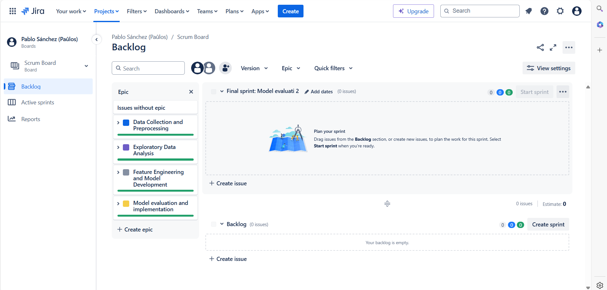

Dataset: https://www.kaggle.com/code/neharoychoudhury/credit-card-fraud-detection-analysis/notebook

Also did this project using JIRA and AGILE method "SCRUM". Successfully completing the sprints designed in it's correspondent deadlines. Learn about JIRA and how to do projects in a simulation of what a real life environment could look like. 

Where you can see the final work: https://www.kaggle.com/code/paulitos/credit-card-fraud-prediction-scrum-method-pablo-sa

## Project Management with Jira

This project was managed using the Agile methodology with Jira as our primary tool for tracking tasks, sprints, and team progress.

### Jira Scrum Board

### Workflow
We followed a structured Agile workflow:
- **Sprint Planning**: Tasks were created and prioritized in Jira, with user stories assigned to each sprint.
- **Daily Standups**: Progress was tracked daily, with updates to the Jira board reflecting the current state of the sprint.
- **Sprint Review and Retrospective**: At the end of each sprint, we reviewed completed work, discussed blockers, and planned improvements for the next sprint.

### Key Metrics
- **Sprint Velocity**: Tracked and analyzed through Jira, helping us predict future sprint capacity.
- **Burndown Charts**: Used to monitor the progress of each sprint.

